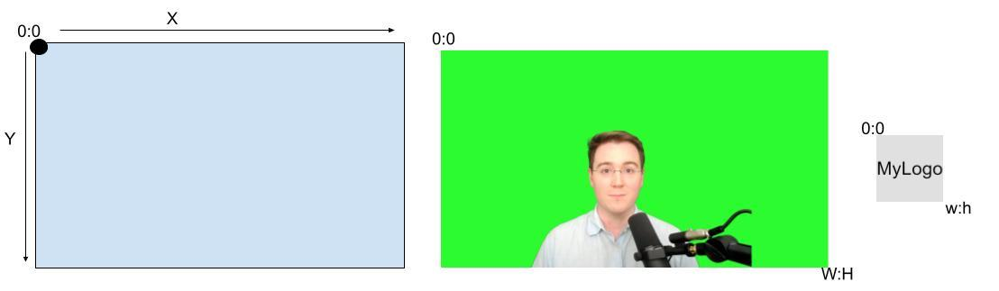
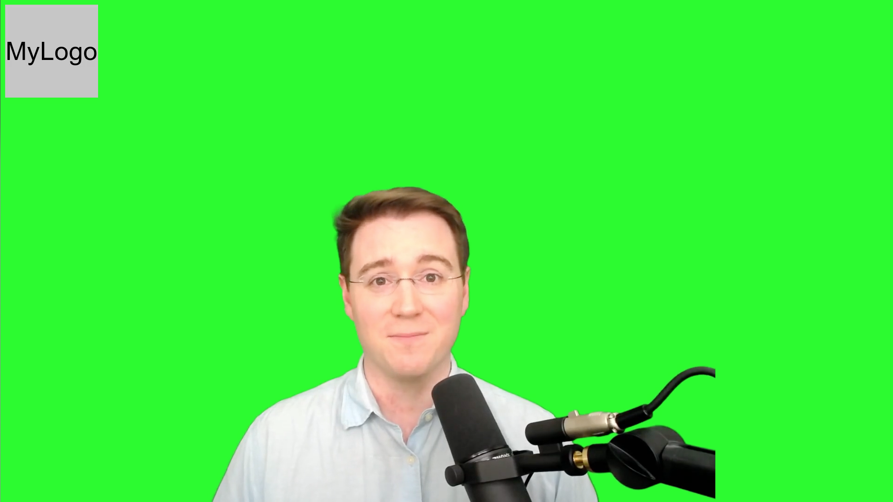
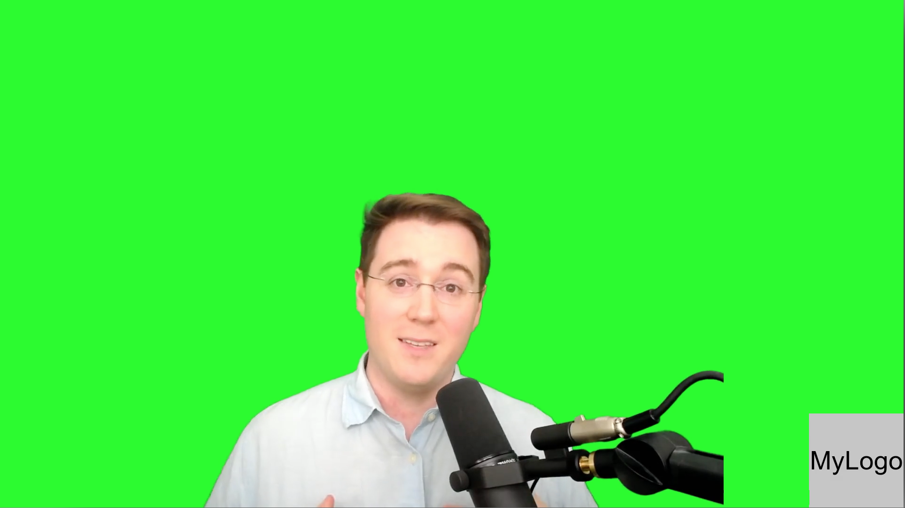
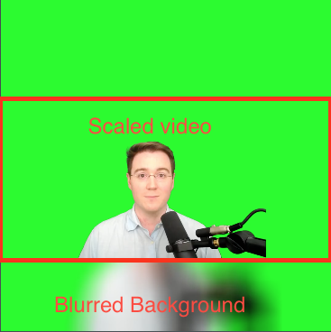
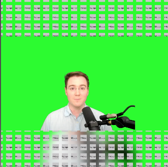

# Intro
This workshop is designed to be a quick (<20min) introduction to the `ffmpeg` command line tool for creating / editing videos. 

## Presentation
There is a presentation that accompanies this workshop, you can find the links below. 
- [Google Slides](https://docs.google.com/presentation/d/1RYZgO7Yli9Ptuzr1L-lkmZl-c2lrQsHzcRXyupOvCqE)
- [PDF](img/presentation.pdf)

**Youtube Video of Presentation (Click to Play)**

[](https://www.youtube.com/watch?v=4TRHUuVsCSI)


# Setup
In this workshop we will use 2 tools, `ffmpeg` to create videos and `vlc` to view the results. 

### OSX
Install using brew
`brew install ffmpeg, vlc`

### Linux
Use your package manger, should be similar to `apt-get install ffmpeg, vlc`
- [ffmpeg](https://ffmpeg.org/download.html#build-linux)

### Windows
- [ffmpeg](https://ffmpeg.org/download.html#build-windows)
- [VLC](https://www.videolan.org/vlc/download-windows.html)

Confirm your install is successful by running `ffmpeg -h`. 

# Basic Use

`ffmpeg` as a command line tool has alot of power and thus alot of options for use. To see an overview of the options available to you run `ffmpeg -h`. 

The order of options is as follows:
```sh
ffmpeg [options] [[infile options] -i infile]... {[outfile options] outfile}...
```

In this workshop we will walk through a couple of common use cases, after which you should feel comfortable with `ffmpeg` enough to self explore and self learn via [Google](https://googlethatforyou.com?q=ffmpeg%20how%20to). 

## Convert Type
To convert files from one type to another simply specify the input file and the output file, `ffmpeg` will do it's best to convert between the formats.

`ffmpeg -i input.flv output.mp4` 

By default OSX  will try to use the quicktime codec to format the .mp4 file, this is not optimal, so we will override this by specifying the codec as `libx264`. 

To convert the `intro.flv` file lets use the following command. 

```sh
ffmpeg -i intro.flv -c:v libx264 intro.mp4 
```
This specify's the following information

|command|description|
|---|---|
|`-i intro.flv`| input file is intro.flv|
|`intro.mp4`| output file is outro.mp4|
|`-c:v libx264`| specify the `-c` codec to use for the `:v` video channel|


## Trim Video

The `intro.mp4` file has a bit of a problem with it, the first 2 seconds needs to be trimmed off. To achieve this we will specify a time to cut out of the video. 

In the following command we specify a time slice from 2s->4s to cut out of the video. We then overwrite the original video by setting the output file to overwrite the input file.

```sh
ffmpeg -i intro.mp4 -ss 00:00:02 -to 00:00:04 -c:v libx264 intro.mp4 
```

|command|description|
|---|---|
|`-ss`| starts the time offset|
|`-to`| time to stop|


This is an explicit time spec, you can also do relative with the `-t` duration, `-frames` to specify number of frames, or `-fs` to limit file size. 

## Concatenate Video
There are two methods for concatenating video with ffmpeg, the **concat demuxer** and the **concat protocol**. The concat demuxer uses a file with a list of videos to join together. The concat protocol allows you to pass the files directly via command line. The demuxer tends to be the most stable, while the protocol is handy for batch scripts. 

### concat demuxer
To join all the video pieces together we'll use the `concat` demuxer. This will use a file called `videos.txt` to determine the order in which to sequence the video files. Please note that for this step to be successful it is a good idea to have all the files in the same format, otherwise you may have issues. 

```sh
ffmpeg -f concat -i videos.txt -c copy output.mp4
```

```md
# videos.txt
file 'intro.mp4'
file 'mid.mp4'
file 'end.mp4'
```

|command|description|
|---|---|
|`-f concat`| specify concatination|
|`-i videos.txt`| use the videos.txt file to specify input files|
|`-c copy`| use the same codec as the input file|

### concat protocol
To specify the concatentation directly on the command line you can use the concat protocol.

```sh
ffmpeg -i "concat:intro.mp4|mid.mp4|end.mp4" -c copy output2.mp4
```

Note that this may not work on certain versions of ffmpeg. 

## Watermark

To overlay one asset on top of another use the `-filter_complex "overlay=Width:Height` option. As the name `filter_complex` implies, the filter can be very complex, but it also has simple options. 

The overlay grid starts in the top left corner of the image and width counts left to right, height counts top to bottom.



To put the logo watermark at position (10,10) we will set `"overlay=10:10"`.



```sh
ffmpeg -i output.mp4 -i logo.png -filter_complex "overlay=10:10" output2.mp4
```

When using 2 images you can use the abbreviations for the height and width of `W:H` for the first image and `w:h` for the second image. Thus we can move the water mark to the bottom right corner using the `"overlay=W-w:H-h"` command to position it at the bottom right corner of the first image, less the dimensions of the logo. 



```sh
ffmpeg -i output.mp4 -i logo.png -filter_complex "overlay=W-w:H-h" output2.mp4
```

|command|description|
|---|---|
|`-filter_complex`| Use the mighty filter, but beware it's power!|
|`"overlay=width:height"`| Set overlay position. Bonus: this can be a function to make it move!|

**`overlay` Docs**
- [ffmpeg overlay docs](https://ffmpeg.org/ffmpeg-filters.html#overlay)

# Advanced Use

Now that we've got the basics covered, lets jump into the more advanced uses of the `-filter_complex` option. Specifically we will look at how to create layers and then stack them together to create a output file. 

Note that you may need to use bash to run these commands as some command lines like zsh will sanitize the commands to break them. 

## Formatting for Social Media

Different social media platforms have different dimensions for optimal video performance. The best method for reformatting a video is to crop and scale it, but in this case we will simply be resizing the video and blurring the background with a sampled image from the video to make it appear dynamic. 



In the command below we will define our scale 1080:1080 as the output size because this is generally a safe ratio for all social media sites. In the `filter_complex` we will create the `[bg]` background layer by defining a `boxblur` with blur radius and relevant settings. Then we will define the `[fg]` foreground image as a scaled down to fit 1080x608 size video. Then we will create the `[outv]` or output layer to be efined as the foreground overlaying the background and positioned in the center vertically. Next we will maps the `[outv]` layer to the output layer, and map the audio from the original video to the output layer. Finally we will specify where to save the output layer as a file name. 

```sh
ffmpeg -i output.mp4 \
	-filter_complex \
		"[0:v]scale=1080:1080,
			setsar=1,
			boxblur=luma_radius=min(h\,w)/20:luma_power=1:chroma_radius=min(cw\,ch)/20:chroma_power=1[bg];
		 [0:v]scale=1080:608:force_original_aspect_ratio=decrease[fg];
		 [bg][fg]overlay=(W-w)/2:(H-h)/2[outv]" \
	-map [outv] \
	-map 0:a? \
	output_social.mp4
```

This may seem a bit complicated, but just remember that in a `filter_complex` you seperate layers with `;`, you define layers by adding `[layername]` to the end of deffinitions, and at the end you stack the layers up as you see fit. So in essence all we do is define `[outv] = [bg]+[fg]`, but with more complicated syntax. 

### Instagram

|ratio|pixels|
|---|---|
|9:16|1080x1920|
|1:1|1080x1080|
|4:5|1080x1350|

```sh
ffmpeg -i output.mp4 \
	-filter_complex \
		"[0:v]scale=1080:1080,
			setsar=1,
			boxblur=luma_radius=min(h\,w)/20:luma_power=1:chroma_radius=min(cw\,ch)/20:chroma_power=1[bg];
		 [0:v]scale=1080:608:force_original_aspect_ratio=decrease[fg];
		 [bg][fg]overlay=(W-w)/2:(H-h)/2[outv]" \
	-map [outv] \
	-map 0:a? \
	output_instagram.mp4
```

### Twitter

|ratio|pixels|
|---|---|
|1:1|1200:1200|

Minimum width : 600px for square, 640px for other ratios
Supported Ratio's 1:1 -> 2:1
If height exceeds width video will be cropped 1:1

```sh
ffmpeg -i output.mp4 \
	-filter_complex \
		"[0:v]scale=1200:1200,
			setsar=1,
			boxblur=luma_radius=min(h\,w)/20:luma_power=1:chroma_radius=min(cw\,ch)/20:chroma_power=1[bg];
		 [0:v]scale=1200:720:force_original_aspect_ratio=decrease[fg];
		 [bg][fg]overlay=(W-w)/2:(H-h)/2[outv]" \
	-map [outv] \
	-map 0:a? \
	output_twitter.mp4
```

### Youtube

This command is purposefully left incomplete, try experimenting with it to determine the correct format. 

|ratio|pixels|
|---|---|
|16:9|1920x1080|

```sh
Now you try!
```

## Moving Watermark

In this example we will add a `[logo]` layer to complex filter and use a function to modify the position of the logo over time. Using the `mod()` function as part of the overlay as well as the `t` value which represents the time we can change the position of the logo. 

Note that in this example we create the following layers:
- [bg] = blurry box
- [mg] = [bg] + moving logo
- [fg] = scaled down original video
- [vout] = [mg]+[fg]

In this example we also clip the length of the clip at 10s (`-t 00:00:10`) to keep it short on processing time. 



```sh
ffmpeg -i output.mp4  -loop 1 -i logo.png -filter_complex " \
[1:v]scale=iw*0.2:-2, pad='iw+20:ih+20:10:10:0x000000@0.0' ,tile=25x25[logo]; 
[0:v]scale=1080:1080,setsar=1,boxblur=luma_radius=min(h\,w)/20:luma_power=1:chroma_radius=min(cw\,ch)/20:chroma_power=1[bg]; \
[bg][logo]overlay=-'mod((((t-0.9)*120)/5),w*0.2)':-'mod((((t-0.9)*120)/5),w*0.2)'[mg]; \
[0:v]scale=1080:608:force_original_aspect_ratio=decrease[fg]; \
[mg][fg]overlay=(W-w)/2:(H-h)/2[vout]" \
-map "[vout]" -map 0:a? -t 00:00:10 output_moving_logo.mp4
```

# Further Reading
- [ffmpeg Docs](https://ffmpeg.org/ffmpeg.html)
- [ffmpeg tutorials](https://www.google.com/search?hl=en&q=ffmpeg%20cool%20hacks)
